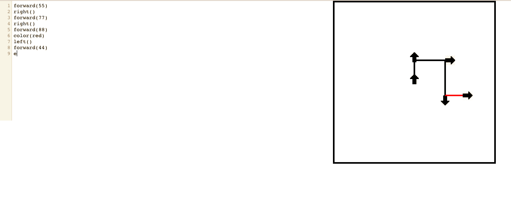
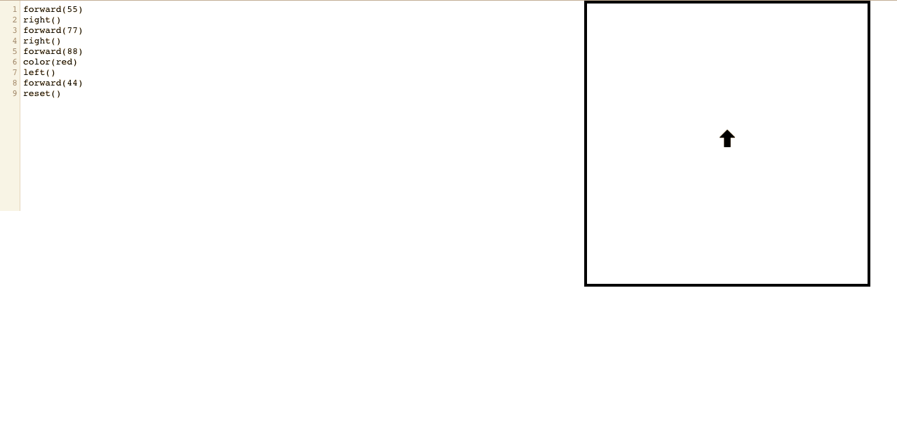
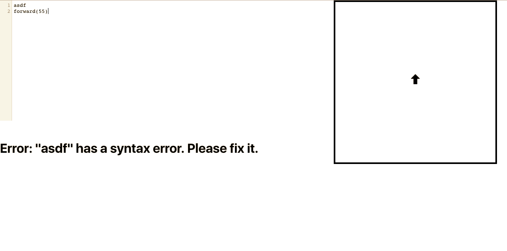

# Logo-Writer Simulator Application
## By Justin Xie

## How it was built
1. Used ReactJS
2. Comprises of three main components
  * Main App Component
  * CodeMirror React Component (imported from: https://github.com/JedWatson/react-codemirror)
  * HTML Canvas Component

# Instructions
## Commands
The list of commands are shown below:
  * forward(x)
    - draw a line *x* pixels in the current direction
    - ex. *forward(20)* will draw a line 20 pixels long with the current color and direction
  * color(x)
    - change the color subsequent line(s) a different color
    - colors include: red, green, black, blue, and yellow
    - ex. *color(red)* will change the current color to red, and the subsequent lines will be drawn read (until changed)
  * right()
    - rotates the current direction 90 degrees to the right
  * left()
    - rotates the current direction 90 degrees to the left
  * clear()
    - clears the canvas and reverts to default settings and location
    
## Directions
Enter a single command per line and press *Enter*. Lines will be rendered as you begin to type the next command.

## Demonstration
In the CodeMirror code editor on the left-hand side, the user enters a single valid command per line. 
Here you can see that the commands rendering an image based on the list of commands.

Arrows are attached to the end of each line, facing the current direction, and indicating the end of the line segment.

If the users chooses to reset their work in the midst of coding it, they can do so with the reset() method.

If the user makes a mistake, an error message will pop up below the editor, informing them to correct their mistakes.

## Coding Process/Reflection
Inspired to challenge myself and to take on bold, new and exciting projects, I faced a few challenges while developing this application, mainly because I have not worked with code editor technologies before,
such as CodeMirror. I wasn't very experienced with HTML Canvas either, and having to learn how to integrate these components together represented the bulk of the challenge.

However, I am proud of this application project given my lack of experience.
