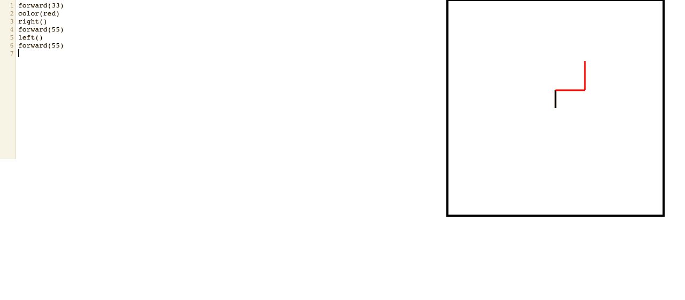
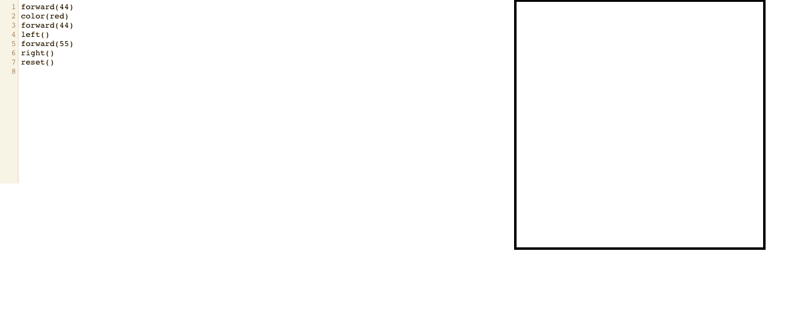
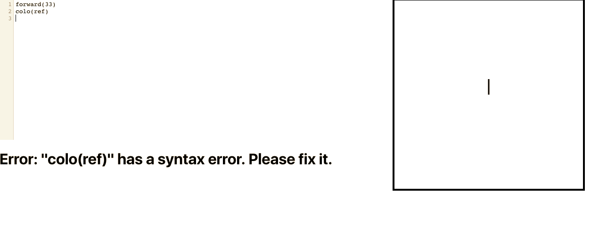

This project was bootstrapped with [Create React App](https://github.com/facebook/create-react-app).

# Logo-Writer Coding Puzzle
## By Justin Xie

Here is my submission for the Viv Lab Frontend Coding Puzzle

## How it was built
1. Used ReactJS
2. Comprises of three main components
  * Main App Component
  * CodeMirror React Component (imported from: https://github.com/JedWatson/react-codemirror)
  * HTML Canvas Component

## How it works
In the CodeMirror code editor, the user writes a single valid command per line. Here you can see that the commands
rendering an image based on the list of commands.

If the users chooses to reset their work in the midst of coding it, they can do so with the reset() method.

If the user makes a mistake, an error message will pop up below the editor, informing them to correct their mistakes.

## Coding Process
I found this challenge to be a bit challenging, primarily because I have not worked with code editor technologies before,
including CodeMirror. I haven't had much experience with HTML Canvas either, and having to learn how to incorporate both of
these components was the bulk of the challenge.

However, I am proud of the submission I made given my lack of experience. There are some things I would have liked to have improved
on had I had more time than just a weekend to complete it.

## Important Notes
* I unfortunately was not able to properly render the cursor onto the canvas, as I couldn't manage to delete old renderings of the
cursor from prior renderings. I also couldn't properly rotate the cursor based on the direction. Because of that, I chose to omit the cursor component.

* I have experience writing tests for functional programs in my software courses, but I am not as familiar with testing React Components
so I wasn't able to properly write tests for my application.
